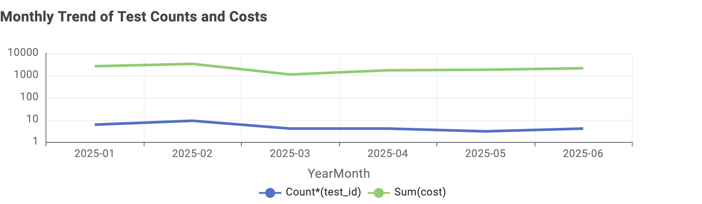
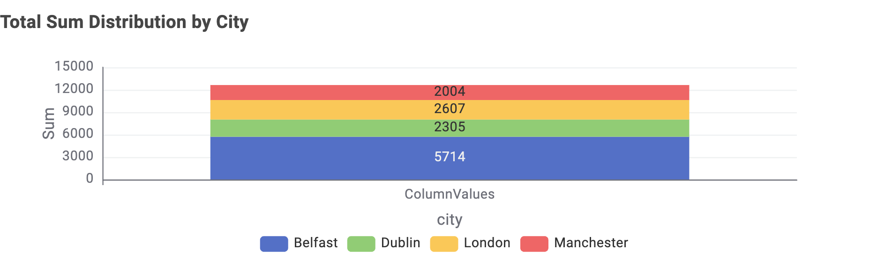

# Patient Pathway Analysis (KNIME Workflow)

## Objective
This project analyzes patient diagnostic test data to uncover:
- Trends in testing volume and costs over time.  
- City-wise distribution of diagnostic tests.  

It demonstrates how KNIME workflows can be applied to healthcare data for better insights, supporting data-driven decision-making in patient diagnostics and treatment pathways.

---

## Workflow
The workflow processes patient and test datasets, joins them, extracts date fields, groups the data, and visualizes results.  

  
  
  

---

## Steps
1. **Load Data**: Import patient and test datasets (CSV Readers).  
2. **Join Data**: Combine patient and test data.  
3. **Date Processing**: Convert dates and extract Year–Month.  
4. **Aggregation**: Group data to compute monthly summaries.  
5. **Visualization**:  
   - 📈 **Line Plot** → Monthly test counts and costs.  
   - 📊 **Bar Chart** → City-wise test cost comparison.  
   - 🥧 **Pie Chart** → Distribution of tests across cities.  

---

## Tech Stack
- **KNIME Analytics Platform**  
- **CSV Data Processing**  
- **Data Visualization** (Line Plot, Bar Chart, Pie Chart)  

---

## Real-World Relevance
This project simulates how diagnostic test data can be transformed into actionable insights.  
It reflects workflows used in **precision medicine** and **clinical decision support**, where trends in testing help optimize healthcare costs and patient outcomes.

---

## How to Run
1. Clone this repository:
   ```bash
   git clone https://github.com/maheshnilewar/Patient_Pathway_Analysis_KNIME.git
